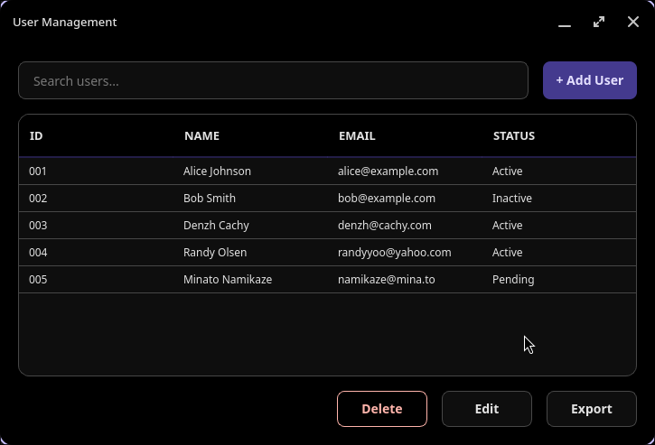
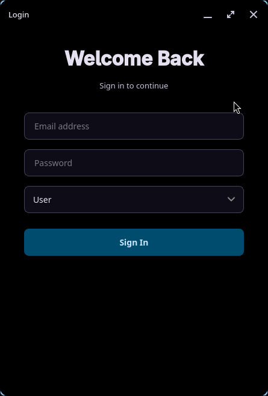
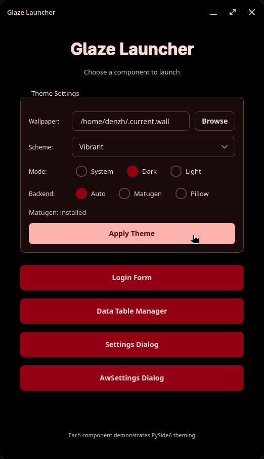
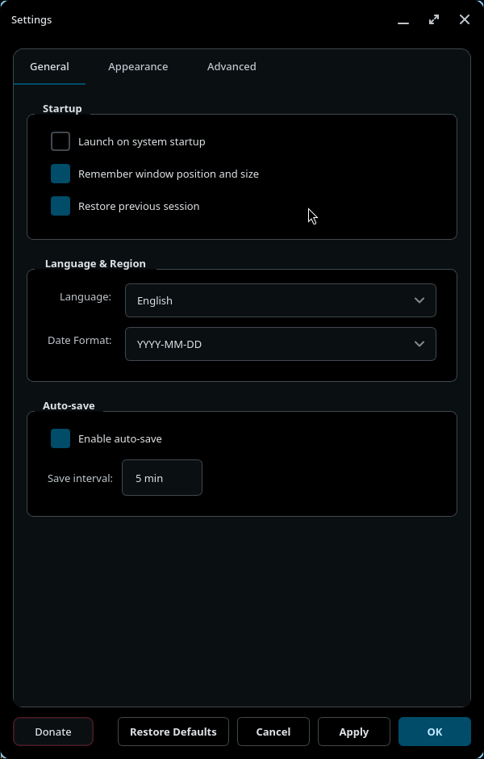
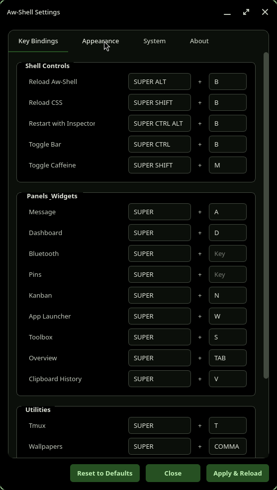

# Glaze


## Features

- **Modern Dark Theme**: Professional color palette optimized for Linux desktop environments
- **Custom Widgets**: Platform-specific fixes for Linux Qt rendering issues
  - `ThemedComboBox`: Properly styled dropdowns with custom popup rendering
  - `RoundedHeaderView`: Table headers with rounded corners and hover effects
- **Centralized Theming**: Single `Theme` dataclass for consistent styling across components
- **Standalone Binaries**: Compile to native executables with Nuitka (15-30MB each)
- **Demo Applications**:
  - Interactive launcher with component selector
  - Login form with validation
  - Full CRUD data table with CSV persistence
  - Settings dialog
  - Aw-Shell settings stub

<h2><sub></sub> Screenshots</h2>
<table align="left">
  <tr>
    <td colspan="2"></td>
    <td colspan="1" align="left"><td>
  </tr>
  <tr>
    <td colspan="1"></td>
    <td colspan="1"></td>
    <td colspan="1" align="left"></td>
  </tr>
</table>

## Installation

### Requirements

- Python 3.12+
- Linux
- PySide6 6.6.0+
- UV package manager (recommended) - [Installation guide](https://docs.astral.sh/uv/getting-started/installation/)

### Install from Source

**Recommended: Using UV (10-100x faster)**

```bash
# Clone the repository
git clone https://github.com/Awareness10/glaze.git
cd glaze

# Create virtual environment with UV
uv venv
source .venv/bin/activate

# Install with locked dependencies (reproducible builds)
uv sync --extra dev
```

**Alternative: Using pip**

```bash
# Clone the repository
git clone https://github.com/Awareness10/glaze.git
cd glaze

# Create virtual environment
python -m venv .venv
source .venv/bin/activate

# Install in editable mode with dev dependencies
pip install -e ".[dev]"
```

## Quick Start

### Running Components

**Option 1: Run directly without installation (development)**
```bash
# Interactive launcher (works without pip install)
python main.py
```

**Option 2: After installing with `pip install -e .`**
```bash
# Using Python module
python -m glaze

# Run specific components
python -m glaze.components.form
python -m glaze.components.data_table

# Or using installed console scripts
glaze-launcher
glaze-login-form
glaze-data-table
```

### Using in Your Project

```python
from glaze import theme, get_base_stylesheet
from glaze.widgets import ThemedComboBox, RoundedHeaderView
from PySide6.QtWidgets import QApplication, QMainWindow

class MyWindow(QMainWindow):
    def __init__(self):
        super().__init__()
        self.setStyleSheet(get_base_stylesheet())

        # Use themed widgets
        combo = ThemedComboBox()
        combo.addItems(["Option 1", "Option 2"])

        # Access theme colors
        print(f"Background color: {theme.bg_primary}")

app = QApplication([])
window = MyWindow()
window.show()
app.exec()
```

## Building Standalone Binaries

### Prerequisites

Install system dependencies required for Nuitka standalone builds:

```bash
# CachyOS/Arch Linux
sudo pacman -S patchelf

# Debian/Ubuntu
sudo apt install patchelf

# Fedora
sudo dnf install patchelf
```

### Build Commands

Compile components to native executables using Nuitka:

```bash
# Build all components
python build.py

# Build specific component only
python build.py --component launcher
python build.py --component form
python build.py --component data_table

# Debug build (faster compilation, includes console)
python build.py --debug

# Clean build artifacts
python build.py --clean
```

Built binaries are placed in the `dist/` directory as single compressed executables:
- `dist/glaze-launcher` - Interactive component selector
- `dist/login-form` - Login form demo
- `dist/data-table` - Data table CRUD application

Each binary is a self-contained executable with zstd compression (Qt libraries, Python runtime bundled). Run directly:
```bash
./dist/login-form
./dist/glaze-launcher
```

## Project Structure

```
src/glaze/
├── __init__.py          # Package exports (theme, widgets)
├── __main__.py          # Interactive launcher
├── theme.py             # Core Theme dataclass and stylesheet generators
├── widgets/             # Custom widget components
│   ├── __init__.py
│   ├── combo_box.py     # ThemedComboBox
│   └── header.py        # RoundedHeaderView
└── components/          # Demo applications
    ├── __init__.py
    ├── form.py          # LoginWindow
    └── data_table.py    # DataTableWindow, UserDialog
```

## Architecture

### Theme System

The framework uses a centralized `Theme` dataclass (frozen/immutable) containing all color and spacing values:

```python
from glaze.theme import theme

# Access theme values
bg_color = theme.bg_primary      # "#1a1a2e"
accent_color = theme.accent      # "#e94560"
border_radius = theme.border_radius  # "8px"
```

Stylesheet generators create consistent styling:
- `get_base_stylesheet()` - Main window styles
- `get_dialog_stylesheet()` - Modal dialog styles
- `get_table_container_style()` - Table container with borders/shadow

### Custom Widgets

#### ThemedComboBox

Solves Linux Qt dropdown rendering issues with custom QListView popup:

```python
from glaze.widgets import ThemedComboBox

combo = ThemedComboBox()  # Automatically themed
combo.addItems(["Item 1", "Item 2"])
```

#### RoundedHeaderView

Custom QHeaderView with QPainter rendering for rounded top corners:

```python
from glaze.widgets import RoundedHeaderView
from PySide6.QtCore import Qt

header = RoundedHeaderView(Qt.Orientation.Horizontal, table)
table.setHorizontalHeader(header)
```

### Demo Components

#### Login Form (`form.py`)
- Centered layout with title/subtitle
- ThemedComboBox integration
- Input validation with QMessageBox

#### Data Table (`data_table.py`)
- CSV persistence with auto-save
- Auto-incrementing IDs (never reused)
- Add/Edit/Delete operations
- Search/filter functionality
- Export to CSV
- Custom rounded header with shadow effects

## Customization

### Creating a Custom Theme

```python
from glaze.theme import Theme

# Create custom theme
my_theme = Theme(
    bg_primary="#0f0f0f",
    text_primary="#ffffff",
    accent="#ff6b6b",
    # ... other colors
)

# Replace global theme (not recommended)
# Better: pass to components directly
```

### Adding New Components

1. Create file in `src/glaze/components/new_component.py`
2. Import theme and widgets:
   ```python
   from glaze.theme import get_base_stylesheet
   from glaze.widgets import ThemedComboBox
   ```
3. Create window class and `main()` function
4. Add to `components/__init__.py` exports
5. Add to `build.py` COMPONENTS dict for compilation

## Development

### Running Tests

Manual testing:
```bash
# Run components individually
python -m glaze.components.form

# Test compiled binaries
./dist/login-form
```

### Code Style

- Use `theme` singleton for all color/spacing values
- Import from `glaze.*` (not relative imports)
- Follow existing patterns (main() function, stylesheet application)
- Always use `ThemedComboBox` instead of `QComboBox` on Linux

## Contributing

Contributions are welcome! Please:

1. Fork the repository
2. Create a feature branch (`git checkout -b feature/amazing-feature`)
3. Commit your changes (`git commit -m 'Add amazing feature'`)
4. Push to the branch (`git push origin feature/amazing-feature`)
5. Open a Pull Request

## License

Licensed under the [MIT License](LICENSE). See the LICENSE file for details.

## Acknowledgments

- Built with [PySide6](https://doc.qt.io/qtforpython/)
- Compiled with [Nuitka](https://nuitka.net/)
- Designed for Hyprland environments

---
Project Link: [https://github.com/Awareness10/Glaze](https://github.com/Awareness10/Glaze)
